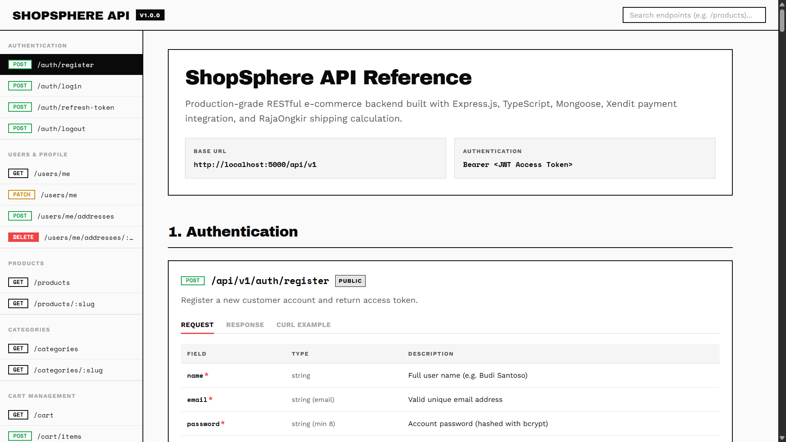

# 🌌 ShopSphere API

[](https://www.typescriptlang.org/)
[](https://nodejs.org/)
[](https://expressjs.com/)
[](https://www.mongodb.com/)
[](https://vitest.dev/)

ShopSphere API is a production-grade, highly secure, and feature-complete e-commerce REST backend built using Node.js, Express.js, Mongoose ODM, and TypeScript strict mode. It manages the full purchase lifecycle end-to-end without manual intervention handling identity, dynamic catalogs, cart syncing, checkout calculations, payment callbacks (Xendit), shipping costs (RajaOngkir), coupons, transactional emails (Resend), in-app notifications, product reviews, and returns.

---

## 🎨 Interactive Web Documentation Preview

An interactive, brutalist-styled API reference web interface is provided directly inside the repository at [`docs/web/index.html`](file:///docs/web/index.html).



> **Features of the Web Docs:**
> - **Brutalist Design System**: Built with zero border-radius, Archivo Black & Space Mono typography, and high-contrast terminal brutalism.
> - **Scroll-Spy Sidebar**: Real-time active navigation following viewport scroll position.
> - **Request / Response / cURL Tabs**: Interactive code block switching with one-click copy to clipboard.
> - **Real-time Filter & Search**: Instantly filter across 20 endpoint groups by route or keyword.

---

## 🛠️ Technology Stack

| Layer | Technology |
| :--- | :--- |
| **Language & Runtime** | TypeScript (strict mode) + Node.js (ES Modules) |
| **Web Framework** | Express.js |
| **Database & ORM** | MongoDB + Mongoose ODM |
| **Authentication** | JWT (`jsonwebtoken`) + `bcrypt` (rounds: 12) |
| **Payment Gateway** | Xendit API (Sandbox / Production) |
| **Email Gateway** | Resend SDK (HTML templates with responsive layout) |
| **Shipping Gateway** | RajaOngkir Starter API |
| **Search Engine** | MongoDB Atlas Search (text index on name, description, tags) |
| **Input Validation** | Zod |
| **Testing Engine** | Vitest + Supertest + MongoDB Memory Server |
| **Package Manager** | `pnpm` |

---

## 🚀 Key Features & Business Rules

### 1. Identity & Auth
* **Double Tokens**: Access token (expires 15m) + Refresh token (expires 7d) stored in a secure `httpOnly` cookie.
* **Password Reset**: Generates a secure, 1-hour time-limited token sent via email, invalidated immediately on use.
* **Address Book**: Multi-address profiles with a single default address flag.

### 2. E-Commerce Purchase Flow
* **Cart Logic**: Enforces a limit of 20 unique products (`MAX_CART_ITEMS`). Automatically syncs and checks product price/availability on `GET /cart`.
* **Coupons**: Validates 6 business rules (active status, start/end dates, global limit, min order amount, applicable products/categories, and user usage count limit).
* **RajaOngkir Cost Integration**: Denpasar, Bali (`Origin City ID: 114`) is configured as the shipping origin. Real-time cost comparisons are made during checkout with zero cost-tolerance.
* **Checkout Rollback**: Invoices are generated on Xendit. If invoice creation fails, the order document is automatically rolled back (deleted) to prevent database discrepancies.
* **Webhook Settlement**: Payment confirmed webhooks verify the callback token header, atomically decrement product stock, clear the user's cart, and log anomalies if stock is depleted at payment time.

### 3. Communication Layer
* **Resend Emails**: Transactional emails dispatch HTML templates for order placement, invoice receipts, shipping tracking, delivery notices, return resolutions, and password resets.
* **In-App Notifications**: Alerts are triggered automatically for payment successes, shipments, low-stock warnings (for admins, threshold: 5), and returns. Endpoint controllers support pagination and unread counts.

### 4. Post-Purchase & Quality
* **Product Reviews**: Customer can review products only after the order is marked `DELIVERED`. Enforces a strict one-review-per-product-per-order compound index. Atomically aggregates and recalculates the product's `averageRating` and `totalReviews`.
* **Return Requests**: Requests must be submitted within 7 days of delivery. Ensures return item quantities do not exceed original order quantities. If approved, order status transitions to `REFUNDED` and product stocks are automatically restored.
* **Admin Dashboard**: Exposes store metrics (total orders, total revenue, low-stock item count, and pending return count).

---

## 📂 Project Structure

The codebase utilizes a **domain-driven, feature-based** directory structure under `src/`:

```
shopsphere-api/
  docs/
    web/              # Static Web Documentation UI (HTML/CSS/JS)
      assets/         # Web docs images and SVG favicon
      index.html      # Single-page documentation web app
      style.css       # Brutalist design system tokens
      script.js       # Search, tab switching, and scroll-spy JS
  src/
    config/           # DB connection, environment configuration, database seeders
    middlewares/      # Auth security guards, global error handler, zod validations
    modules/
      auth/           # Registration, login, token refresh, forgot/reset password
      users/          # Profiles and address book management
      admin/          # Dashboard stats and user account activations
      products/       # Catalog CRUD, search filters, Atlas Search indexes
      categories/     # Multi-level hierarchical categories tree
      cart/           # Shopping cart item and quantity operations
      wishlist/       # Wishlist addition and removal
      checkout/       # Subtotal/shipping cost calculation & Xendit invoices
      orders/         # History, details, and order status state machine transitions
      stock/          # Admin stock adjustments and stock logs
      payments/       # Xendit callback webhooks
      reviews/        # Verified reviews and rating aggregation
      emails/         # Resend templates and sender wrapper
      notifications/  # In-app alerts query and updates
      coupons/        # Coupon validation and admin CRUD
      shipping/       # RajaOngkir province/city lists and shipping cost calculators
    routes/           # Central route mounting
    types/            # Shared TypeScript type definitions
    utils/            # Standard response formatters and AppError classes
```

---

## 📋 API Endpoints Summary

All routes are versioned and prefixed under `/api/v1/`.

| Group | Method & Route | Description | Auth |
| :--- | :--- | :--- | :--- |
| **Auth** | `POST /auth/register` | Register customer account | Public |
| **Auth** | `POST /auth/login` | Login user & set cookie | Public |
| **Auth** | `POST /auth/refresh-token` | Renew 15m access token | Cookie |
| **Auth** | `POST /auth/logout` | Clear refresh token | Bearer |
| **Users** | `GET /users/me` | Fetch user profile & addresses | Bearer |
| **Users** | `PATCH /users/me` | Update name / phone / avatar | Bearer |
| **Users** | `POST /users/me/addresses` | Add shipping address | Bearer |
| **Products** | `GET /products` | Search & filter product catalog | Public |
| **Products** | `GET /products/:slug` | Retrieve single product detail | Public |
| **Categories** | `GET /categories` | Hierarchical categories tree | Public |
| **Cart** | `GET /cart` | Get cart & sync price snapshots | Bearer |
| **Cart** | `POST /cart/items` | Add product item to cart | Bearer |
| **Shipping** | `POST /shipping/cost` | Calculate courier costs via RajaOngkir | Public |
| **Checkout** | `POST /checkout` | Place order & get Xendit payment link | Bearer |
| **Orders** | `GET /orders` | View customer order history | Bearer |
| **Payments** | `POST /payments/webhook` | Xendit payment settlement webhook | Webhook |
| **Reviews** | `POST /reviews` | Submit product review (delivered order) | Bearer |
| **Admin** | `POST /admin/products` | Create product listing | Admin |
| **Admin** | `PATCH /admin/orders/:id/status` | Advance order status + tracking # | Admin |
| **Admin** | `PATCH /admin/stock/:productId` | Manual stock adjustment | Admin |

*(For the complete reference of all 20 endpoint groups with full request/response payloads, open [`docs/web/index.html`](file:///docs/web/index.html))*

---

## ⚙️ Getting Started

### Prerequisites
- Node.js (v20 or higher)
- `pnpm` (v9 or higher)
- MongoDB instance (Local or Atlas Cluster)

### Installation

1. **Clone the repository:**
   ```bash
   git clone https://github.com/Deanity/ShopSphereAPI-Express.git
   cd ShopSphereAPI
   ```

2. **Install dependencies:**
   ```bash
   pnpm install
   ```

3. **Configure environment variables:**
   Copy the template and fill in your credentials:
   ```bash
   cp .env.example .env
   ```

4. **Run development server:**
   ```bash
   pnpm dev
   ```
   - **Health check URL**: [http://localhost:5000/api/v1/health](http://localhost:5000/api/v1/health)
   - **Web Documentation**: Open `docs/web/index.html` in your browser.

---

## 🧪 Running Tests

Vitest is configured to run tests inside isolated project configurations using an in-memory MongoDB Server:

```bash
# Run all tests
pnpm test

# Run unit tests only
pnpm test:unit

# Run integration/E2E tests only
pnpm test:e2e
```

---

## 👥 Credits & Contact

<div align="left">
  <a href="https://www.instagram.com/shoyou.nt/" target="_blank">
    
  </a>
  <a href="https://discord.com/" target="_blank">
    
  </a>
  <a href="mailto:dendradetama2@gmail.com" target="_blank">
    
  </a>
  <a href="https://www.linkedin.com/in/dendra-de-tama/" target="_blank">
    
  </a>
</div>

<br/>

<div align="center">
  <i>"Code is art. Make it beautiful."</i> De4nity
</div>
